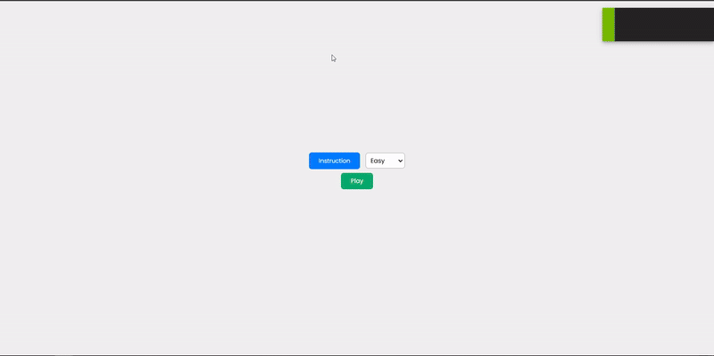

# Sapieris

## Spēles demonstrēšana

## Saite uz prezentāciju - [saite uz prezentāciju](https://prezi.com/view/XFBoWTRX30q4wnVcRX3h/)

## Saite uz skaņas ierakstu- [saite uz skaņas ierakstu](https://drive.google.com/file/d/1a3MPx0Ph9b9GsjPwF6BhPDcRm6OBH-x8/view?usp=drive_link)

## Spēles apraksts

**Sapieris** ir klasiska mīnu meklēšanas spēle, kuras mērķis ir atklāt visas drošās šūnas, izvairoties no mīnām. Spēle piedāvā dažādus grūtības līmeņus un intuitīvu lietotāja saskarni, padarot to piemērotu dažāda vecuma spēlētājiem.

## Spēles funkcijas

- **Grūtības līmeņi**:
  - Viegls (8x8, 10 mīnas)
  - Normāls (10x10, 20 mīnas)
  - Grūts (15x15, 40 mīnas)
  - Eksperts (20x20, 60 mīnas)
- **Karoga izmantošana**: Atzīmējiet aizdomīgās šūnas ar karogu.
- **Automātiska skaitļu atklāšana**: Atklāj apkārtējo šūnu skaitu, kas satur mīnas.
- **Uzvaras un zaudējuma noteikšana**: Paziņojumi par spēles iznākumu.

## Kā spēlēt

1. Izvēlieties grūtības līmeni sākuma izvēlnē.
2. Klikšķiniet uz šūnām, lai tās atklātu.
3. Izmantojiet labo peles pogu, lai atzīmētu mīnas ar karogu.
4. Izvairieties no klikšķināšanas uz mīnām.
5. Atklājiet visas drošās šūnas, lai uzvarētu.
